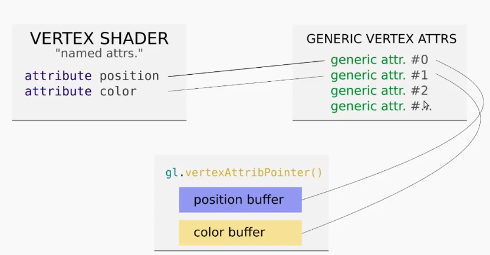
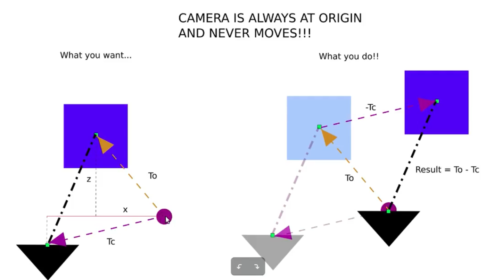

# Learning WebGL

##### Lecture 1
- Use standard template for html file
- Create a main.js and embed it as a script in html
- For webserver install
```npm install express```
- For running webserver
```node server.js```

##### Lecture 2
- WebGL uses Right handed coordinate system
	- x: right
	- y: top
	- z: out of the screen

- Shader program. Shader is something that decides what shade of colour it will output to the screen. 
	- Vertex shader: Take incoming vertex data, determines XYZ position.
	- Fragment shader: Runs once per pixel on the screen. Interpolates all coordinates in between another vertex, until all vertices. Coordinates to Colour mapping.

- Double buffer: To ensure all pixels change at the same time. One is hidden, one is visible.

- Uniforms: Global variables for the CPU to communicate with Shader programs

##### Lecture 3
- Outline of program
	- vertexData = [...]
	- create Buffer
	- load vertexData into Buffer
	- create vertex shader
	- create fragment shader
	- create program
	- attach shaders to program
	- enable vertex attributes
	- draw

- Bind to tell GL that the buffer is a array of vertices
- bufferData: STATIC_DRAW or DYNAMIC_DRAW for third argument
- shaderSource: GL shading language created by OpenGL, as string
- ```attribute vec3 position``` specifies that it can always take next 3 components and put it into a vec3
- ```getAttribLocation``` finds the WebGL index of the position in the shaders.
- All attributes start off as disabled, need to enable.
- ```vertexAttribPointer``` arguments : how many data pts at a time, and of what type
- gl_Position and gl_FragColor are case sensitive

##### Lecture 4
- Generic attributes: Serve as connections b/w named attribs and buffers

- Binding between the generic attribute and the named attribute in the shader happens automatically.
- Best practice: call ```getAttribLocation``` to get the location instead of hardcode
- Need to set precision in fragmentShader, doesn't work otherwise.
- Mobile phones might not support high precision float.

##### Lecture 5
- For some reason, if I try to run the glmatrix stuff at the top of the program, it doesn't print anything on the canvas
- GL shader language can use * for multiplication
- ```getUniformLocation``` needs to be run after useProgram
- The transformations applied to the matrix are replayed on the vertex in the reverse order as in the code.

##### Lecture 6
- 3 overlapping vertices: More vertices than required for colours
- GL draws in chronological order. The lowest ones gets drawn last
- Solution: Test depth. One that's closest to the camera gets drawn last.

##### Lecture 7
- ```mat4.perspective``` parameters:
	- Vertical FOV
	- Aspect Ratio
	- Near cull distance
	- Far cull distance
- ``` mat4.multiply(finalMatrix, projMatrix, matrix)``` means ```finalMatrix = projMatrix * matrix```
- Aspect ratio defined by canvas width, reload page to make changes

##### Lecture 8 
- Camera never moves, move the object around to simulate camera motion

- ```mvpMatrix = projMatrix * viewMatrix * modelMatrix```

##### Lecture 9
